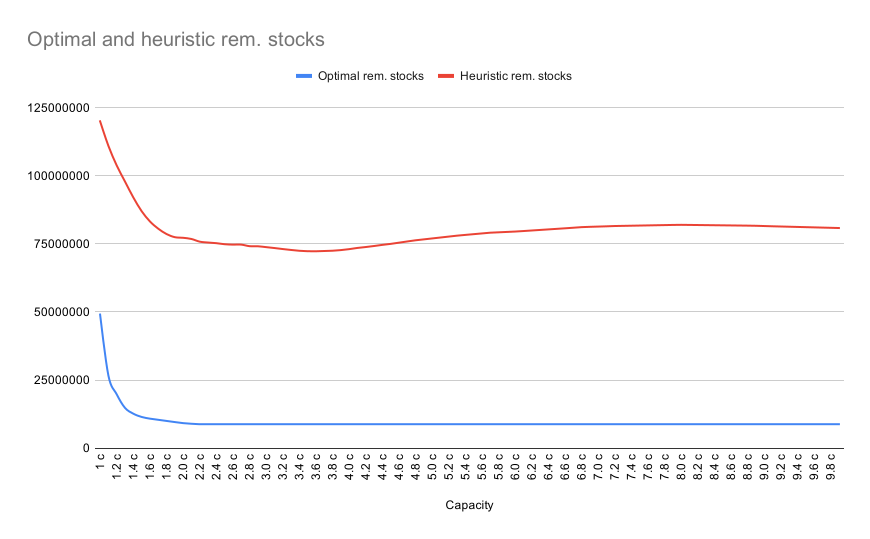
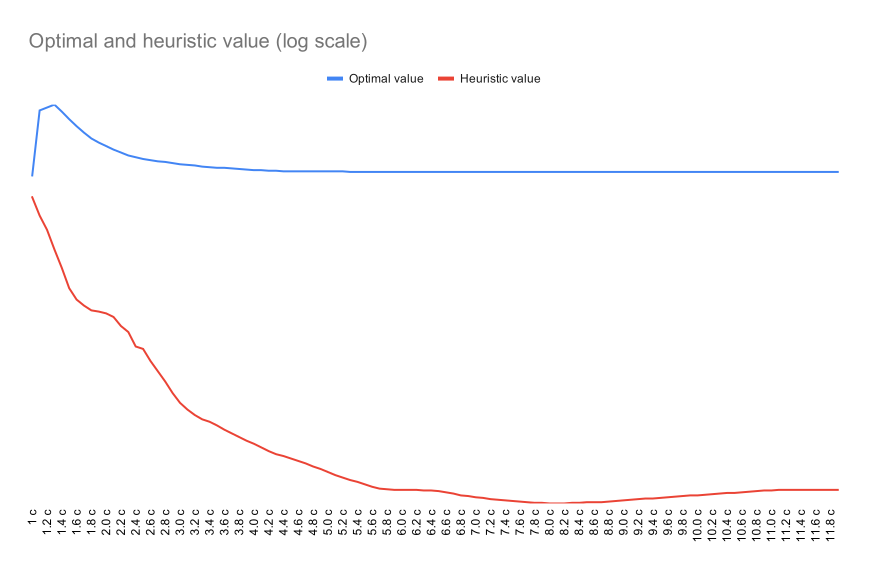
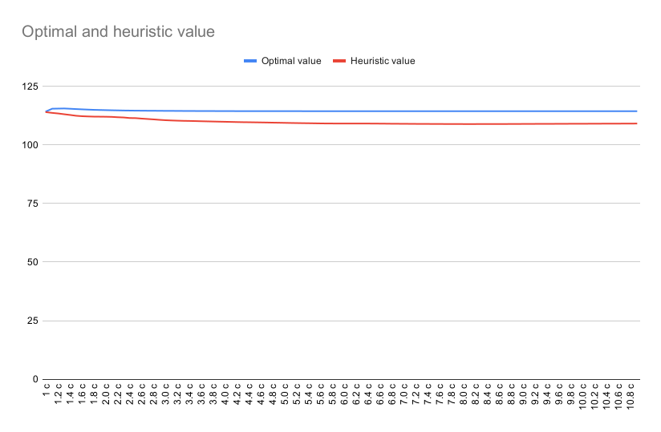

# AMOD 20-21

## Heuristic

**if $t + \Delta^i < 180$:**

$\ \ \ \ \!$ **if $t = 0$:**
    $\ \ \ \ \ \ \ \ \ \ \ \ \ x^i_t = b^i_t$
$\ \ \ \ \!$**else if $t-\Delta^i \ge 0$ and $t+1-\Delta^i< 0$:**
    $\ \ \ \ \ \ \ \ \ \ \ \ \ x^i_t = s^i_{t-1} - x^i_{t-\Delta^i} + b^i_t$
$\ \ \ \ \!$**else:**
    $\ \ \ \ \ \ \ \ \ \ \ \ \ x^i_t = s^i_{t-1} - x^i_{t-\Delta^i} - x^i_{t+1-\Delta^i} + b^i_t$

$\ \ \ \ \!$ **if $x^i_t < 0$:**
    $\ \ \ \ \ \ \ \ \ \ \ \ \ x^i_t = 0$

$\ \ \ \ \!$**if $t = 0$:**
    $\ \ \ \ \ \ \ \ \ \ \ \ \ s^i_t = - x^i_{t} + b^i_t$
$\ \ \ \ \!$**else if $t-\Delta^i < 0$:**
    $\ \ \ \ \ \ \ \ \ \ \ \ \ s^i_t = s^i_{t-1} - x^i_{t} + b^i_t$
$\ \ \ \ \!$**else if $t-\Delta^i  \ge 0$ and $t+1-\Delta^i < 0$:**
    $\ \ \ \ \ \ \ \ \ \ \ \ \ s^i_t = s^i_{t-1} - x^i_{t} - x^i_{t-\Delta} + b^i_t$
$\ \ \ \ \!$**else:**
    $\ \ \ \ \ \ \ \ \ \ \ \ \ s^i_t = max(s^i_{t-1} - x^i_{t} - x^i_{t-\Delta^i} + b^i_t,\ x_{t+1-\Delta^i})$

**else:**
$\ \ \ \ \!$ **$x^i_t = 0$**
$\ \ \ \ s^i_t = max(s^i_{t-1} - x^i_{t} - x^i_{t-\Delta^i} + b^i_t,\ x_{t+1-\Delta^i})$

## Graph of result

